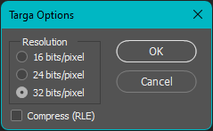
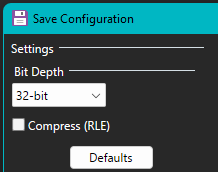
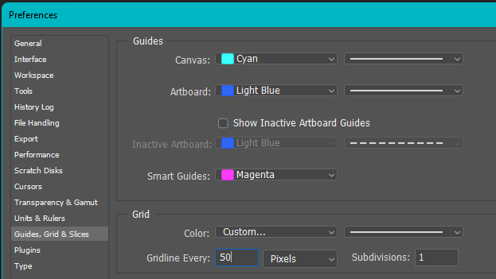
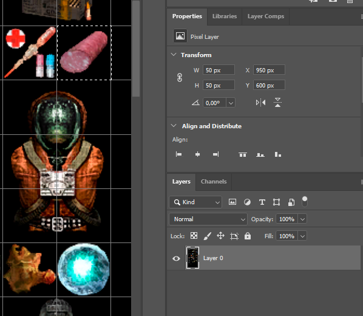
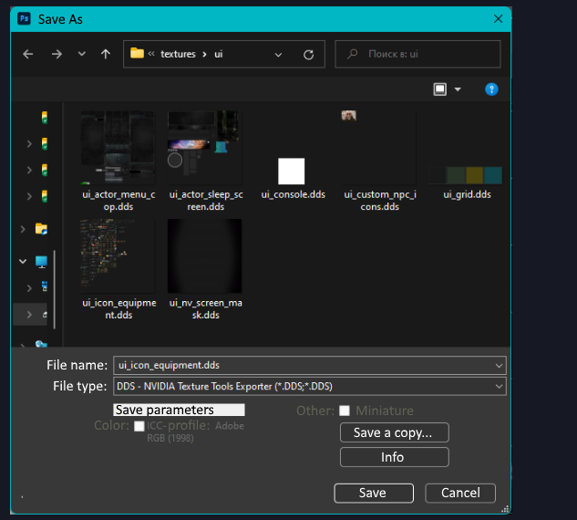
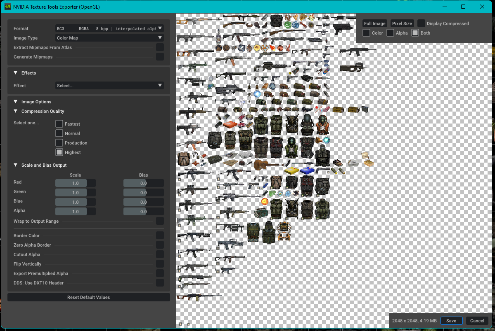

# Working Correctly With Icon Atlases

This page is based on Hrust's guide to preparing and saving icon atlases for S.T.A.L.K.E.R. The original topic was published on [AP-PRO](https://ap-pro.ru/forums/topic/4205-pravilnaya-rabota-s-atlasami-ikonok/).

## Prepare the Tools

For icon work, use two applications:

- Photoshop CS5/CS6 or CC;
- [Paint.NET](https://www.getpaint.net/).

Avoid using Stalker Icon Editor for this task. Use [TGA](https://en.wikipedia.org/wiki/Truevision_TGA) as an intermediate source format and save it as a 32-bit image.

## Add a New Icon

It is easier to add new icons in [Paint.NET](https://www.getpaint.net/). Create a new layer, paste the required image onto it, resize it with bilinear scaling, select the area, cut it, and paste it onto the main layer. This replaces the previous icon if the cell already contained one.

After saving, open the atlas in Photoshop. Enable the grid with `Ctrl+'`; the grid size is configured in preferences, and a standard cell is usually 50 pixels.

> [!IMPORTANT]
> Do not use the rightmost and bottommost atlas cells: they are incomplete and a few pixels smaller than the others.

Select the icon together with its color and alpha channel. Adjust the icon inside the cell if needed, then save the file.

To move an icon from one atlas to another, select it in the first atlas, copy it, and paste it into the second one. Copying color and alpha together is preferable, because it avoids transferring them separately.

## Find Coordinates and Size

Open the layers panel and unlock the layer. The properties panel will then show the selected area's position and size.

> [!TIP]
> In Photoshop CS5/CS6, coordinates are available with `F8`; in newer versions they are shown in the properties panel.

For example, if the `X` position is `950` and the atlas cell size is `50`, divide `950` by `50` to get `19`. This value goes into `inv_grid_x`. Calculate the `Y` coordinate the same way.

If width `W` is `50`, divide it by `50` to get `inv_grid_width = 1`. Height is calculated the same way. For atlases with `100x100` icons, coordinates and sizes usually only require dropping two zeroes from the value.

> [!WARNING]
> After unlocking the layer, do not save the atlas. Just close the file.

## Save the DDS

Open the atlas in [Paint.NET](https://www.getpaint.net/) or in Photoshop with a DDS plugin installed.

### Saving in Photoshop

### Saving in [Paint.NET](https://www.getpaint.net/)

## Sources

- Author: Hrust.
- Original: [AP-PRO: Correct Work With Icon Atlases](https://ap-pro.ru/forums/topic/4205-pravilnaya-rabota-s-atlasami-ikonok/).
- Author contacts: [VK](https://vk.com/hrusteckiy), [AMK](https://amk-team.ru/forum/profile/57247-hrust/), [AP-PRO](https://ap-pro.ru/profile/4757-hrust/), Discord `hrusteckiy`.
