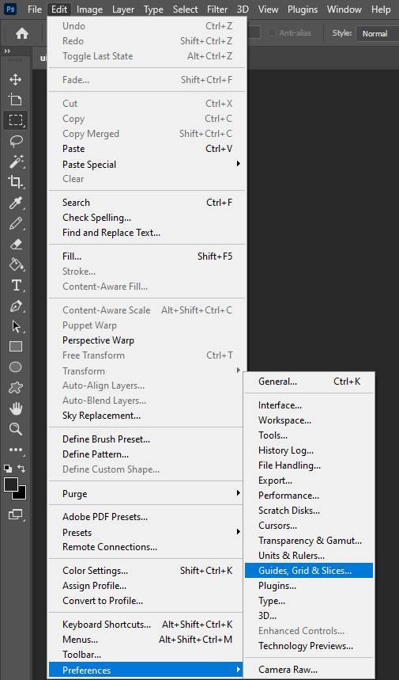
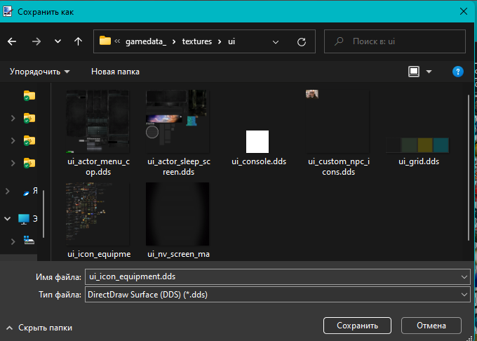
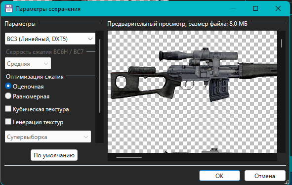

# Правильная работа с атласами иконок

Материал основан на гайде Hrust о подготовке и сохранении атласов иконок для S.T.A.L.K.E.R. Оригинальная тема опубликована на [AP-PRO](https://ap-pro.ru/forums/topic/4205-pravilnaya-rabota-s-atlasami-ikonok/).

## Подготовьте инструменты

Для работы с иконками удобно использовать две программы:

- Photoshop CS5/CS6 или CC;
- [Paint.NET](https://www.getpaint.net/).

Stalker Icon Editor для этой задачи лучше не использовать. В качестве промежуточного исходника держите файл в формате [TGA](https://ru.wikipedia.org/wiki/Truevision_TGA) и сохраняйте его как 32-битное изображение.

## Добавьте новую иконку

Новые иконки проще добавлять в [Paint.NET](https://www.getpaint.net/). Создайте новый слой, вставьте на него нужное изображение, подгоните размер с билинейным масштабированием, выделите область, вырежьте ее и вставьте на основной слой. Так новая иконка заменит старую, если она уже была в ячейке.

После сохранения откройте атлас в Photoshop. Включите сетку сочетанием `Ctrl+'`; размер сетки настраивается в параметрах, а стандартная ячейка обычно равна 50 пикселям.

> [!IMPORTANT]
> Не используйте крайние правые и нижние ячейки атласа: они неполные и на несколько пикселей меньше остальных.

Выделяйте иконку вместе с цветом и альфа-каналом. При необходимости поправьте положение иконки внутри ячейки и сохраните файл.

Чтобы перенести иконку из одного атласа в другой, выделите ее в первом атласе, скопируйте и вставьте во второй. Лучше сразу копировать цвет вместе с альфа-каналом, чтобы не переносить их отдельно.

## Узнайте координаты и размер

Откройте панель слоев и разблокируйте слой. После этого в свойствах станет видно положение и размер выбранной области.

> [!TIP]
> В Photoshop CS5/CS6 координаты можно посмотреть через `F8`; в новых версиях они доступны в панели свойств.

Например, если позиция `X` равна `950`, а размер ячейки атласа `50`, разделите `950` на `50` и получите `19`. Это значение записывается в `inv_grid_x`. Для координаты `Y` расчет такой же.

Ширина `W` равна `50`: делим на `50` и получаем `inv_grid_width = 1`. Высота считается аналогично. Для атласов с иконками `100x100` координаты и размеры обычно сводятся к тому, что у значения нужно отбросить два нуля.

> [!WARNING]
> После разблокировки слоя не сохраняйте атлас. Просто закройте файл.

## Сохраните DDS

Откройте атлас в [Paint.NET](https://www.getpaint.net/) или в Photoshop с установленным DDS-плагином.

### Сохранение в Photoshop

### Сохранение в [Paint.NET](https://www.getpaint.net/)

## Источники

- Автор: Hrust.
- Оригинал: [AP-PRO: Правильная работа с атласами иконок](https://ap-pro.ru/forums/topic/4205-pravilnaya-rabota-s-atlasami-ikonok/).
- Контакты автора: [VK](https://vk.com/hrusteckiy), [AMK](https://amk-team.ru/forum/profile/57247-hrust/), [AP-PRO](https://ap-pro.ru/profile/4757-hrust/), Discord `hrusteckiy`.
